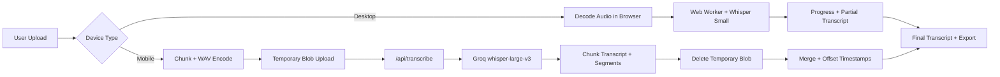

<p align="center">
  
</p>

<h1 align="center">Audio Transcription Tool</h1>

<p align="center">
  Privacy-first speech-to-text for real users: local on desktop, secure cloud fallback on mobile.
</p>

<p align="center">
  <a href="https://audio-transcription.app"><strong>Live Demo</strong></a>
  <br />
  <sub>Free, no sign-up, multilingual, and optimized for long recordings.</sub>
</p>

<p align="center">
  
  
  
  
  
</p>

## Screenshots

| Desktop | Mobile |
| --- | --- |
|  |  |

## Why This Project

Most transcription tools force users into uploads, accounts, and unclear privacy tradeoffs. This app keeps the default path privacy-first and fast:

- Desktop: transcription runs in-browser with Whisper Small (WebGPU/WASM).
- Mobile: direct Blob upload + optional direct-URL handoff to Groq Whisper Large V3.
- Abuse resistance: BotID + signed per-chunk session grants on protected cloud routes.
- Long recordings: chunked processing, retry/backoff, and progress-aware UX.

If this project is useful, please star the repo. It helps a lot.

## Core Features

- Free audio-to-text workflow (no sign-up wall).
- Smart mobile fallback when local inference is not practical.
- Chunk-based processing for long recordings.
- Export options: plain text, timestamped text, JSON.
- English + Turkish route/SEO support.
- Privacy page and clear data-handling model.

## How It Works

### 1. Desktop path (local inference)

- Audio is decoded in browser.
- A Web Worker loads `Xenova/whisper-small` via `@huggingface/transformers`.
- Worker reports download/transcription progress and partial text.
- No server call is required for desktop transcription.

### 2. Mobile path (cloud fallback)

- Audio is chunked into upload-safe WAV parts.
- Chunks upload directly from the browser to Vercel Blob storage.
- The client starts one signed transcription session and receives chunk-specific grants.
- When `NEXT_PUBLIC_BLOB_UPLOAD_ACCESS=public`, `/api/transcribe` sends Groq the Blob URL directly.
- When `NEXT_PUBLIC_BLOB_UPLOAD_ACCESS=private`, `/api/transcribe` falls back to the protected Blob proxy route.
- Temporary uploads are deleted after each chunk is transcribed.
- Responses are merged into a full transcript with segment timestamps.

### 3. Long-audio reliability protections

- Larger chunk duration to reduce request count.
- API rate limit tuned for chunk workflows.
- `429`/`5xx` retry with backoff and `Retry-After` handling.
- Abort-safe wait/retry logic for cancellation.

## Architecture



## Tech Stack

- Next.js App Router
- TypeScript (strict)
- Tailwind CSS
- Web Workers
- `@huggingface/transformers`
- `@vercel/blob`
- `botid`
- Groq Audio Transcription API

## Quick Start

### Prerequisites

- Node.js 20+
- npm or pnpm

### Install

```bash
npm install
# or
pnpm install
```

### Run

```bash
npm run dev
# or
pnpm dev
```

Open `http://localhost:3000`.

### Production check

```bash
npm run build && npm run start
# or
pnpm build && pnpm start
```

## Environment Variables

Create `.env.local`:

```bash
GROQ_API_KEY=your_groq_api_key
BLOB_READ_WRITE_TOKEN=your_vercel_blob_read_write_token
TRANSCRIPTION_SESSION_SECRET=your_random_session_secret
NEXT_PUBLIC_BLOB_UPLOAD_ACCESS=public
```

Notes:

- `GROQ_API_KEY` is required for mobile cloud fallback.
- `BLOB_READ_WRITE_TOKEN` is required for direct mobile uploads.
- `TRANSCRIPTION_SESSION_SECRET` is recommended for signed chunk grants. If omitted, the app falls back to `GROQ_API_KEY`.
- `NEXT_PUBLIC_BLOB_UPLOAD_ACCESS` must match your Blob store mode. Use `public` to let Groq fetch audio directly and reduce Vercel Fast Origin Transfer. Use `private` to keep the protected proxy flow.
- Desktop local transcription works without cloud calls.

## Deployment (Vercel)

1. Push this repo to GitHub.
2. Import project in Vercel.
3. Create and connect a Vercel Blob store.
4. Add `GROQ_API_KEY`, `BLOB_READ_WRITE_TOKEN`, and ideally `TRANSCRIPTION_SESSION_SECRET` in Project Settings -> Environment Variables.
5. Set `NEXT_PUBLIC_BLOB_UPLOAD_ACCESS` to match the store. `public` is the recommended production mode if you want to reduce Fast Origin Transfer.
6. In Project Settings -> Security, enable Secure Backend Access with OIDC Federation so BotID server verification can read the `x-vercel-oidc-token` header in functions.
7. Deploy.
8. Keep the committed `vercel.json` WAF challenge rules enabled so direct hits without a session header are challenged at the edge.

## Privacy Model

- Desktop: local-only processing in browser runtime.
- Mobile: audio is uploaded to temporary Blob storage, transcribed via Groq, and then deleted.
- Protected routes use BotID and signed session grants so one transcription job cannot be replayed as unbounded chunk traffic.
- No account or user identity flow is required by the app.

See full policy: [Privacy Policy](https://audio-transcription.app/privacy)

## Troubleshooting

- WASM issues: verify `next.config.mjs` has async WASM + required aliases.
- First desktop run can be slow (model download + shader compile).
- For long recordings, keep the tab open and active during processing.

## Contributing

PRs and issues are welcome. If you propose a change, include:

- Problem statement
- Before/after behavior
- Test or reproduction notes

## License

This project is licensed under the MIT License. See [LICENSE](LICENSE).

Screenshots and logo in this repository are distributed under the same license unless stated otherwise.
