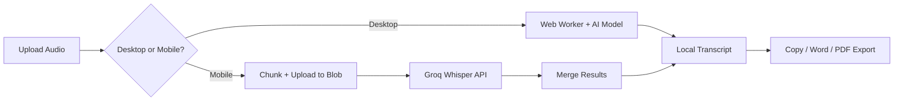

<p align="center">
  
</p>

<h1 align="center">Audio Transcription Tool</h1>

<p align="center">
  Free, privacy-first speech-to-text — local on desktop, secure cloud on mobile.
</p>

<p align="center">
  <a href="https://audio-transcription.app"><strong>audio-transcription.app</strong></a>
</p>

<p align="center">
  
  
  
</p>

## Screenshots

| Landing | Transcript |
| --- | --- |
|  |  |

## Features

- **100% free** — no sign-up, no paywall
- **Desktop**: runs entirely in your browser (Whisper Small via WebGPU/WASM, Moonshine for English)
- **Mobile**: secure cloud transcription via Groq Whisper Large V3
- **12 languages** supported
- **Export**: copy text, copy with timestamps, Word (.docx), PDF
- **Continue with AI**: one-click open transcript in ChatGPT, Claude, Gemini, or Grok
- **Long recordings**: chunked processing with progress tracking & ETA
- **Privacy-first**: desktop audio never leaves your device; mobile uploads are temporary and deleted after processing

## How It Works

```
1. Select Language  →  2. Upload Audio  →  3. Get Transcript
   12 languages           MP3, WAV, M4A       Copy, Word, PDF
```

### Desktop (local)

Audio is decoded in-browser → Web Worker loads the AI model → transcription runs locally with real-time progress. No server calls.

- English → Moonshine (fast, small model)
- Other languages → Whisper Small (WebGPU with WASM fallback)

### Mobile (cloud)

Audio is chunked → uploaded to Vercel Blob → transcribed via Groq API → results merged → blob deleted. Protected by BotID + HMAC-signed session tokens.

## Architecture



## Tech Stack

| Layer | Technology |
| --- | --- |
| Framework | Next.js 16 (App Router) |
| Language | TypeScript (strict) |
| Styling | Tailwind CSS 4 |
| AI Models | Whisper Small, Moonshine Base, Groq Whisper Large V3 |
| Storage | Vercel Blob |
| Bot Protection | BotID |
| Document Export | docx, jsPDF |

## Quick Start

```bash
pnpm install
pnpm dev
```

Open `http://localhost:3000`. Desktop transcription works without any API keys.

## Environment Variables

Create `.env.local` for mobile cloud features:

```bash
GROQ_API_KEY=your_groq_api_key
BLOB_READ_WRITE_TOKEN=your_vercel_blob_token
TRANSCRIPTION_SESSION_SECRET=your_random_secret
NEXT_PUBLIC_BLOB_UPLOAD_ACCESS=public
UPSTASH_REDIS_REST_URL=your_upstash_redis_rest_url
UPSTASH_REDIS_REST_TOKEN=your_upstash_redis_rest_token
RATE_LIMIT_HASH_SECRET=your_independent_random_secret
CRON_SECRET=your_vercel_cron_secret
```

| Variable | Required | Purpose |
| --- | --- | --- |
| `GROQ_API_KEY` | Mobile only | Cloud transcription via Groq |
| `BLOB_READ_WRITE_TOKEN` | Mobile only | Vercel Blob uploads |
| `TRANSCRIPTION_SESSION_SECRET` | Mobile only | HMAC signing for session tokens; use a random secret independent from the Groq key |
| `NEXT_PUBLIC_BLOB_UPLOAD_ACCESS` | Mobile only | `public` (recommended) or `private` |
| `UPSTASH_REDIS_REST_URL` | Production mobile | Shared serverless rate-limit store |
| `UPSTASH_REDIS_REST_TOKEN` | Production mobile | Authentication for the rate-limit store |
| `RATE_LIMIT_HASH_SECRET` | Production mobile | Independent HMAC key used before request identifiers enter the rate-limit store |
| `CRON_SECRET` | Production mobile | Authorizes scheduled cleanup of abandoned temporary uploads |

## Deploy to Vercel

1. Push to GitHub → Import in Vercel
2. Create a Vercel Blob store
3. Add environment variables, including Upstash Redis and `CRON_SECRET`
4. Enable Secure Backend Access (OIDC) for BotID
5. Deploy — `vercel.json` WAF rules are included

## Security

- Origin validation on all API routes
- BotID (client + server) bot detection
- HMAC-SHA256 signed session tokens with TTL
- Vercel edge challenge for requests without session headers
- HMAC-pseudonymized, distributed rate limiting via Upstash Redis
- File type, size, and pathname validation
- Immediate Blob cleanup after successful processing plus scheduled stale-upload cleanup

## Privacy

- **Desktop**: 100% local — audio never leaves your browser
- **Mobile**: temporary cloud processing, blobs deleted after transcription
- **No accounts**, no tracking, no data retention

[Full Privacy Policy](https://audio-transcription.app/privacy)

## License

[MIT](LICENSE)
