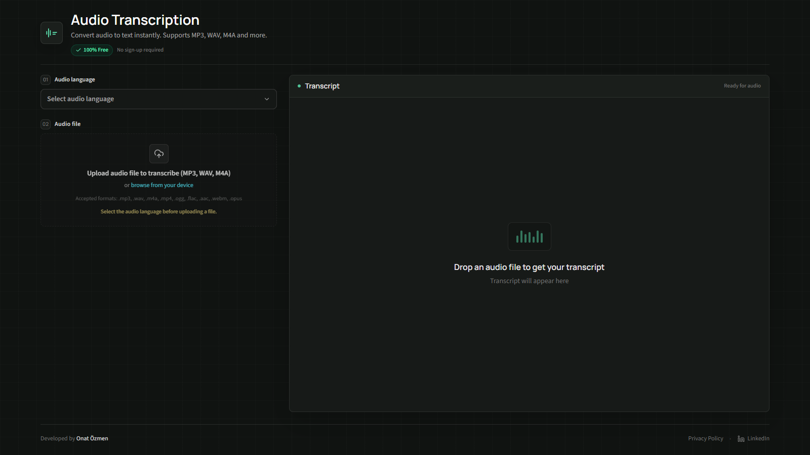
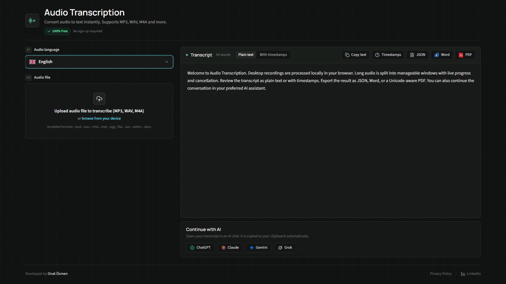
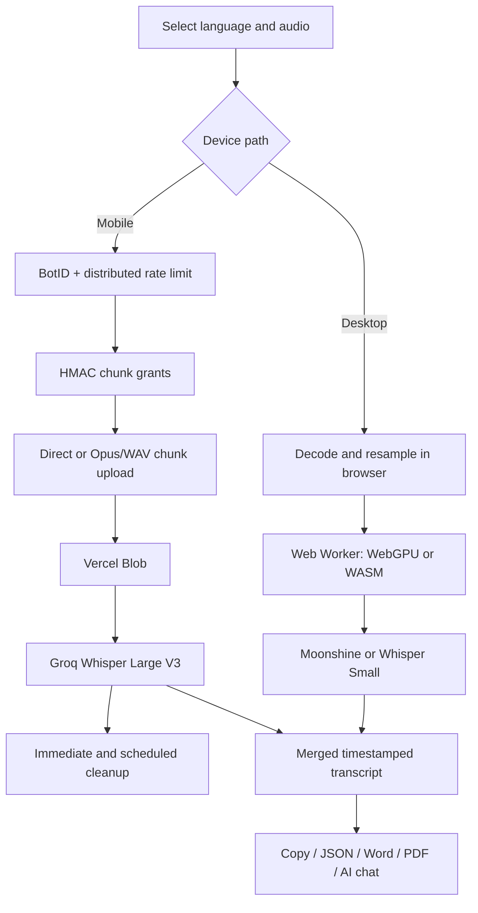

<p align="center">
  
</p>

<h1 align="center">Audio Transcription Tool</h1>

<p align="center">
  Free, privacy-first speech-to-text — local on desktop, secure cloud on mobile.
</p>

<p align="center">
  <a href="https://audio-transcription.app"><strong>audio-transcription.app</strong></a>
</p>

<p align="center">
  
  
  
  
  
</p>

## Screenshots

| Workspace | Transcript & exports |
| --- | --- |
|  |  |

## Highlights

- **100% free** — no sign-up, no paywall
- **Desktop-local transcription** — audio stays in the browser; English uses Moonshine Base and other languages use Whisper Small
- **WebGPU first, WASM fallback** — local inference works across modern desktop browsers
- **Secure mobile cloud path** — temporary Vercel Blob uploads are transcribed with Groq Whisper Large V3
- **Long recording support** — chunked processing, retry/backoff, cancellation, progress, and ETA
- **12 languages / 9 formats** — MP3, WAV, M4A, MP4, OGG, FLAC, AAC, WEBM, and OPUS
- **Cross-platform flag selector** — local SVG flags render consistently on Windows, macOS, iOS, and Android
- **Export** — plain text, timestamped text, JSON, Word (.docx), and Unicode-aware PDF
- **Continue with AI**: one-click open transcript in ChatGPT, Claude, Gemini, or Grok
- **English and Turkish UI** — localized application, metadata, structured data, and privacy pages
- **Privacy-first lifecycle** — successful mobile uploads are deleted immediately; abandoned uploads are removed by a scheduled cleanup job

## Supported Languages

English, Turkish, Spanish, French, German, Italian, Portuguese, Russian, Arabic, Hindi, Japanese, and Korean.

## How It Works

```
1. Select language  →  2. Upload audio  →  3. Review and export
  12 languages          9 file formats       Text, JSON, Word, PDF
```

### Desktop (local)

Audio is decoded and resampled in-browser → a Web Worker loads the AI model → overlapping windows are transcribed sequentially → segments are merged and deduplicated. The audio file is never uploaded.

- English → Moonshine Base (fast, lightweight model)
- Other languages → Whisper Small (WebGPU with WASM fallback)
- Local recordings are limited to 2 hours and guarded by a safe browser decode-size limit

### Mobile (cloud)

Audio is uploaded directly when safe, or decoded and split into mobile-safe Opus/WAV chunks. Every chunk receives a pathname-bound HMAC grant, is uploaded to Vercel Blob, transcribed by Groq, merged with timestamp offsets, and deleted.

The mobile path includes BotID, origin validation, distributed rate limiting, request retries, timeouts, cancellation, and scheduled cleanup for abandoned uploads. Mobile recordings are limited to 2 hours.

## Architecture



## Tech Stack

| Layer | Technology |
| --- | --- |
| Framework | Next.js 16 (App Router) |
| UI | React 19, Tailwind CSS 4, Radix Select, Lucide icons |
| Language | TypeScript (strict) |
| AI Models | Whisper Small, Moonshine Base, Groq Whisper Large V3 |
| Storage | Vercel Blob |
| Bot Protection | BotID |
| Rate Limiting | Upstash Redis REST / Vercel KV REST |
| Document Export | docx, FileSaver, jsPDF |
| Testing | Vitest, ESLint, Next.js production build |

## Quick Start

### Requirements

- Node.js 20.9 or newer
- pnpm 10

```bash
pnpm install
pnpm dev
```

Open `http://localhost:3000`. Desktop transcription works without any API keys.

### Commands

| Command | Purpose |
| --- | --- |
| `pnpm dev` | Start the development server |
| `pnpm test` | Run the Vitest security and validation suite |
| `pnpm lint` | Run ESLint |
| `pnpm build` | Create and type-check the production build |
| `pnpm start` | Start the production server |

## Environment Variables

Create `.env.local` for mobile cloud features:

```bash
GROQ_API_KEY=your_groq_api_key
BLOB_READ_WRITE_TOKEN=your_vercel_blob_token
TRANSCRIPTION_SESSION_SECRET=your_random_secret
NEXT_PUBLIC_BLOB_UPLOAD_ACCESS=public
UPSTASH_REDIS_REST_URL=your_upstash_redis_rest_url
UPSTASH_REDIS_REST_TOKEN=your_upstash_redis_rest_token
RATE_LIMIT_HASH_SECRET=your_independent_random_secret
CRON_SECRET=your_vercel_cron_secret
```

| Variable | Required | Purpose |
| --- | --- | --- |
| `GROQ_API_KEY` | Mobile only | Cloud transcription via Groq |
| `BLOB_READ_WRITE_TOKEN` | Mobile only | Vercel Blob uploads |
| `TRANSCRIPTION_SESSION_SECRET` | Mobile only | HMAC signing for session tokens; use a random secret independent from the Groq key |
| `NEXT_PUBLIC_BLOB_UPLOAD_ACCESS` | Mobile only | `public` (recommended) or `private` |
| `UPSTASH_REDIS_REST_URL` | Production mobile | Shared serverless rate-limit store |
| `UPSTASH_REDIS_REST_TOKEN` | Production mobile | Authentication for the rate-limit store |
| `RATE_LIMIT_HASH_SECRET` | Production mobile | Independent HMAC key used before request identifiers enter the rate-limit store |
| `CRON_SECRET` | Production mobile | Authorizes scheduled cleanup of abandoned temporary uploads |

`KV_REST_API_URL` and `KV_REST_API_TOKEN` can be used instead of the Upstash variable names. Generate independent random values for `TRANSCRIPTION_SESSION_SECRET`, `RATE_LIMIT_HASH_SECRET`, and `CRON_SECRET`; do not reuse the Groq key.

## Deploy to Vercel

1. Import the repository into Vercel.
2. Create and connect a Vercel Blob store.
3. Create an Upstash Redis database or connect Vercel KV.
4. Add the environment variables above.
5. Enable Secure Backend Access (OIDC) for BotID.
6. Deploy. The WAF rules and daily stale-blob cleanup schedule are defined in `vercel.json`.

## Security

- Origin validation on all API routes
- BotID (client + server) bot detection
- HMAC-SHA256 signed session tokens with TTL
- Per-chunk grants bound to exact Blob pathnames
- Vercel edge challenge for requests without session headers
- HMAC-pseudonymized, distributed rate limiting via Upstash Redis
- File extension, MIME type, size, managed-URL, and pathname validation
- Constant-time token and cron-secret comparison
- Immediate Blob cleanup after successful processing plus scheduled stale-upload cleanup

## Privacy

- **Desktop**: 100% local — audio never leaves your browser
- **Mobile**: temporary cloud processing; successful blobs are deleted immediately and stale blobs are removed after the session lifetime plus a grace period
- **No accounts or analytics trackers**
- **Rate-limit identifiers**: IP addresses are HMAC-pseudonymized before entering the shared counter store

[English Privacy Policy](https://audio-transcription.app/privacy) · [Turkish Privacy Policy](https://audio-transcription.app/tr/privacy)

## Project Structure

```text
app/                    Next.js routes, localized pages, API routes, and Web Worker
components/             Upload and language selection controls
lib/                    Transcription security, rate limiting, codecs, exports, and tests
docs/screenshots/       README screenshots
public/                 Project logo
proxy.ts                Locale header proxy used by Next.js
vercel.json             WAF and scheduled cleanup configuration
```

## License

[MIT](LICENSE)
