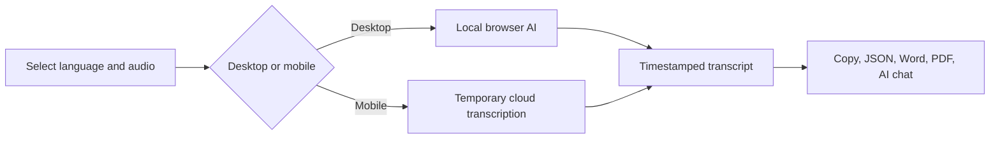

<p align="center">
  
</p>

<h1 align="center">Audio Transcription Tool</h1>

<p align="center">
  Free, privacy-first speech-to-text — local on desktop, secure cloud on mobile.
</p>

<p align="center">
  <a href="https://audio-transcription.app"><strong>audio-transcription.app</strong></a>
</p>

<p align="center">
  
  
  
  
  
</p>

## Screenshots

| Workspace | Transcript & exports |
| --- | --- |
|  |  |

## Highlights

- **100% free** — no sign-up, no paywall
- **Desktop-local transcription** — audio stays in the browser; English uses Moonshine Base and other languages use Whisper Small
- **WebGPU first, WASM fallback** — local inference works across modern desktop browsers
- **Mobile transcription** — audio is processed temporarily in the cloud and removed after the result is returned
- **Long recording support** — chunked processing, retry/backoff, cancellation, progress, and ETA
- **12 languages / 9 formats** — MP3, WAV, M4A, MP4, OGG, FLAC, AAC, WEBM, and OPUS
- **Cross-platform flag selector** — local SVG flags render consistently on Windows, macOS, iOS, and Android
- **Export** — plain text, timestamped text, JSON, Word (.docx), and Unicode-aware PDF
- **Continue with AI**: one-click open transcript in ChatGPT, Claude, Gemini, or Grok
- **English and Turkish UI** — localized application, metadata, structured data, and privacy pages
- **Privacy-first lifecycle** — temporary mobile audio is cleaned up automatically

## Supported Languages

English, Turkish, Spanish, French, German, Italian, Portuguese, Russian, Arabic, Hindi, Japanese, and Korean.

## How It Works

```
1. Select language  →  2. Upload audio  →  3. Review and export
  12 languages          9 file formats       Text, JSON, Word, PDF
```

### Desktop (local)

Audio is decoded and resampled in-browser → a Web Worker loads the AI model → overlapping windows are transcribed sequentially → segments are merged and deduplicated. The audio file is never uploaded.

- English → Moonshine Base (fast, lightweight model)
- Other languages → Whisper Small (WebGPU with WASM fallback)
- Local recordings are limited to 2 hours and guarded by a safe browser decode-size limit

### Mobile (cloud)

Audio is prepared in the browser, split into mobile-safe chunks when needed, and sent for temporary cloud transcription. Results are merged with timestamps and the temporary audio is removed automatically. Progress, retries, cancellation, and recordings up to 2 hours are supported.

## Architecture



## Tech Stack

| Layer | Technology |
| --- | --- |
| Framework | Next.js 16 (App Router) |
| UI | React 19, Tailwind CSS 4, Radix Select, Lucide icons |
| Language | TypeScript (strict) |
| AI Models | Whisper Small, Moonshine Base, Whisper Large V3 |
| Document Export | docx, FileSaver, jsPDF |
| Testing | Vitest and ESLint |

## Quick Start

```bash
pnpm install
pnpm dev
```

Open `http://localhost:3000`. Desktop transcription works without any API keys.

Useful checks:

```bash
pnpm test
pnpm lint
pnpm build
```

## Privacy

- **Desktop**: 100% local — audio never leaves your browser
- **Mobile**: temporary cloud processing with automatic upload cleanup
- **No accounts or analytics trackers**

[English Privacy Policy](https://audio-transcription.app/privacy) · [Turkish Privacy Policy](https://audio-transcription.app/tr/privacy)

## License

[MIT](LICENSE)
